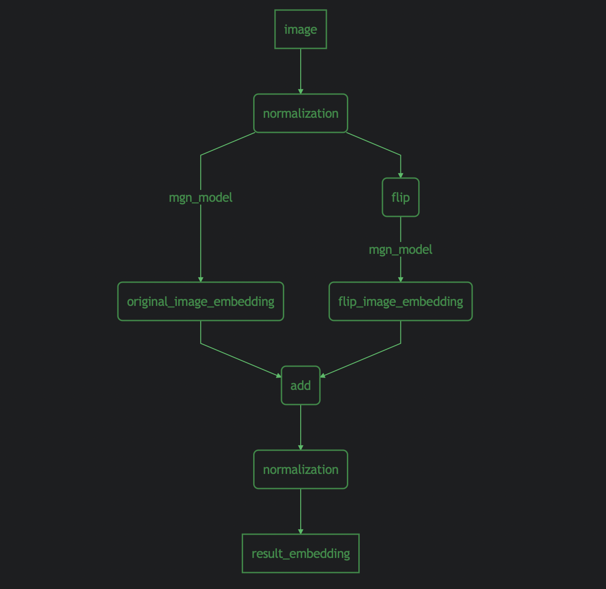

# Mutiple Granularity Network(MGN)-ReId

Reproduction of paper：[Learning Discriminative Features with Multiple Granularitiesfor Person Re-Identification](https://arxiv.org/pdf/1804.01438.pdf)

## The architecture of MGN

## Composition
MGN based on Tensorflow:
 - export_pb.py ： export tensorflow pb file；
 - export_pb_with_pre
_post.py ： export tensorflow pb file containing preprocess and postprocess；
- export_tf_serving_model.py ： export the tensorflow serving model from tensorflow pb；
- export_tf_serving_with_pre_post.py ： export the tensorflow serving model containing preprocess and postprocess from tensorflow pb；

## Train
 - Download dataset [Market1501](http://www.liangzheng.org/Project/project_reid.html)；
 - Parameter initialization using the [pytorch model](https://pan.baidu.com/s/1DbZsT16yIITTkmjRW1ifWQ?errno=0&errmsg=Auth%20Login%20Sucess&&bduss=&ssnerror=0&traceid=) which is trained by [seathiefwang](https://github.com/seathiefwang/MGN-pytorch)(Optional)；
 - Set training parameters and training paths in ```train.py``` and start training;

## Inference

`export_pb_with_pre
_post.py` and `export_tf_serving_with_pre_post.py` pack these operations into the model.

## result
Results without re-ranking on Market-1501

| map | rank@1 | rank@3 | rank@5 | rank@10 |
| --- | --- | --- | --- | --- |
| 0.874288 | 0.947150 | 0.975653 | 0.984857 | 0.990499 |

## Reference
[https://github.com/seathiefwang/MGN-pytorch](https://github.com/seathiefwang/MGN-pytorch)

[https://github.com/lwplw/reid-mgn](https://github.com/lwplw/reid-mgn)

```
@ARTICLE{2018arXiv180401438W,
    author = {{Wang}, G. and {Yuan}, Y. and {Chen}, X. and {Li}, J. and {Zhou}, X.},
    title = "{Learning Discriminative Features with Multiple Granularities for Person Re-Identification}",
    journal = {ArXiv e-prints},
    archivePrefix = "arXiv",
    eprint = {1804.01438},
    primaryClass = "cs.CV",
    keywords = {Computer Science - Computer Vision and Pattern Recognition},
    year = 2018,
    month = apr,
    adsurl = {http://adsabs.harvard.edu/abs/2018arXiv180401438W},
    adsnote = {Provided by the SAO/NASA Astrophysics Data System}
}
```